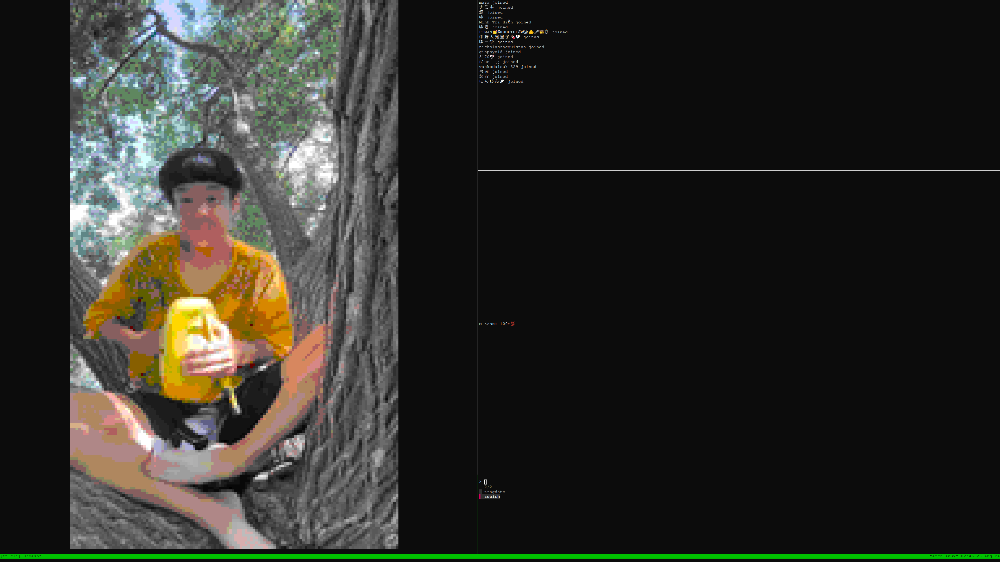

# ttytok

## Description

ttytok is an application that integrates with TikTok using reversed engineered my [rust crate](https://github.com/ZmoleCristian/TikTokLiveRust) . It allows you to monitor live streams, chat events, and user actions in real-time using various tools and utilities.

# GIB ME MONEH 🪙:

## BTC `bc1q0dvmajcammgpesu2flamrdj6rs75cuhum5jyj6`
## ETH `0x3BD77790fc6409441142eb622008d2CdA88aF40c`
## SOL `3BHNm9d9gRaEMhn8yyxN17FD3cNgz55VESj1h6VH467a`


## Screenshot



## Features

- Handle and log various TikTok live events including chats, user joins, and gifts.
- Use `tmux` for an organized multi-pane display.
- Simple scripts for adding and removing TikTok users to monitor.
- Fuzzy finder UI to select TikTok user accounts for live stream monitoring.
- Real-time updates displayed in terminal panes.

## Requirements

- Unix-like operating system (Linux, macOS)
- Root privileges for installation.
- Basic utilities like `bash`, `tmux`, `fzf`, `inotify-tools`, `mpv`.

## Installation

1. Start by installing necessary packages. Run the `install_req.sh` script which will install the required packages based on your package manager:

    ```bash
    
    ./install_req.sh
    ```

2. Build the Rust connector binary:

    2.1. Make sure you have cargo and rust installed:
    ```bash
    curl --proto '=https' --tlsv1.2 -sSf https://sh.rustup.rs | sh -s -- -y
    ```

    2.2. Build the binary:

    ```bash
    
    make
    ```

3. Install the built binary and related scripts:

    ```bash
    
    sudo make install
    ```

## Usage

### Running ttytok

To start using ttytok, simply run the installed executable:

```bash
ttytok
```

This will start a `tmux` session with multiple panes, displaying different aspects of the monitored TikTok live stream and events.

### Managing Users

- **Add User:**

    ```bash
    ttytok add "USERNAME"
    ```

- **Remove User:**

    ```bash
    ttytok remove "USERNAME"
    ```
- **List Users:**

    ```bash
    ttytok list
    ```

- **Add Cookie:**

    ```bash
    ttytok addcookie "COOKIE_STRING"
    ```


### Build and Cleaning

- **Build:**

    ```bash
    make
    ```

- **Clean Build Files:**

    ```bash
    make clean
    ```

### Uninstalling

To completely remove ttytok and all its components:

```bash
sudo make uninstall
```

## Author

Developed by [TragDate](https://github.com/tragdate) 

## License

This project is licensed under the MIT License. See the `LICENSE` file for more details.
