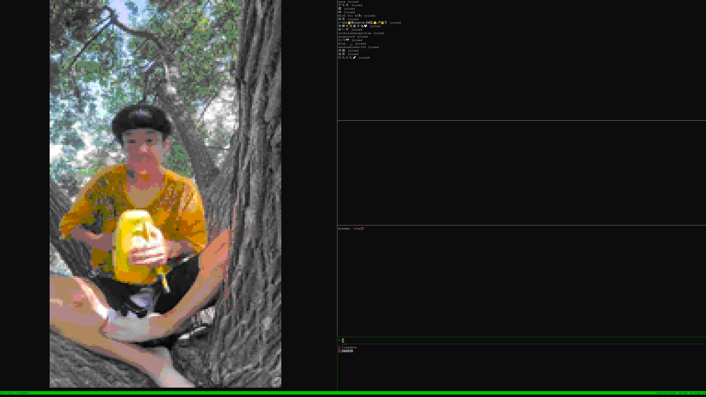

# ttytok

TikTok Live in your terminal. Pure shell, no signing server, no compiled binaries.

tmux multi-pane layout with chat, gifts, joins, video stream, and fzf user picker with live user discovery.



## Install

```bash
sudo make install
```

Dependencies: `bash`, `tmux`, `fzf`, `openssl`, `gzip`, `grep -P` (PCRE). Optional: `mpv` (stream video in terminal).

## Usage

```bash
ttytok                    # open TUI
ttytok add zooich         # add user to watch list
ttytok remove zooich      # remove user
ttytok list               # list saved users
ttytok discover           # check which saved users are live
ttytok check zooich       # check if a specific user is live
```

### TUI keybindings

| Key | Action |
|-----|--------|
| `Enter` | Connect to selected user |
| `Ctrl-D` | Refresh online status (discover) |
| `Ctrl-A` | Add a new user |
| `Ctrl-X` | Remove selected user |

### Layout

```
+--------+---------------------+
|        | joins/follows       |
| stream +---------------------+
| (mpv)  | gifts               |
|        +---------------------+
|        | chat                |
|        +---------------------+
|        | fzf user picker     |
+--------+---------------------+
```

## How it works

Connects directly to TikTok Live WebSocket. No API keys, no signing server, no compiled dependencies. Decodes the protobuf event stream in pure bash and pipes events to tmux panes.

Powered by [PirateTok](https://github.com/PirateTok).

## Uninstall

```bash
sudo make uninstall
```

## License

0BSD
